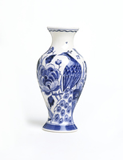
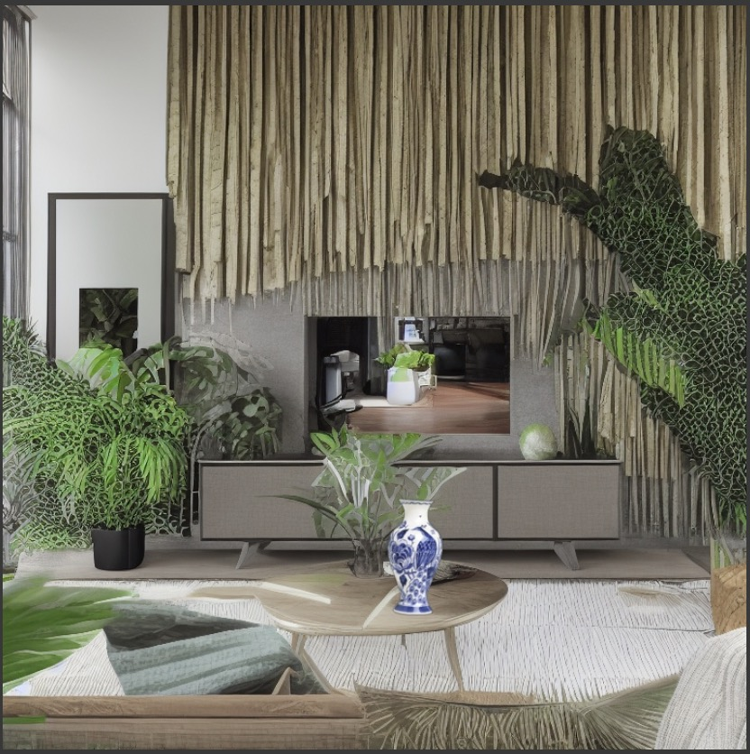

# AI_Product_Placement
# Product Lifestyle Image Generator

This tool automatically places indoor decor product images into realistic lifestyle scenes using generative AI. It processes multiple product images sequentially, seamlessly integrating them into diverse backgrounds while preserving product details.

## Features

- **Sequential Processing**: Handle multiple product images sequentially
- **Realistic Placement**: Seamlessly integrate products into diverse lifestyle backgrounds
- **Depth-Guided Integration**: Use depth maps to ensure natural placement with proper perspective
- **Background Removal**: Automatically remove backgrounds from product images
- **Customizable Prompts**: Control the style and content of generated lifestyle rooms

## Requirements

### Hardware
- Any modern computer with at least 8GB RAM
- CUDA-compatible GPU recommended but not required (will run on CPU or Apple Silicon)
- At least 10GB free disk space to incorporate models from Hugging Face

### Software
- Python 3.8 or higher
- Dependencies listed in `requirements.txt`

## Installation

1. Clone this repository:
   ```
   git clone https://github.com/yourusername/product-lifestyle-generator.git
   cd product-lifestyle-generator
   ```

2. Install the required dependencies:
   ```
   pip install -r requirements.txt
   ```

## Usage

Run the tool with the following command:

```
python main.py --decor_dir /path/to/product/images --output_dir /path/to/output --prompt "A cozy modern living room with a sofa and plants"
```

### Arguments

- `--decor_dir`: Path to the directory containing product images (required)
- `--output_dir`: Path to save the output images (required)
- `--prompt`: Text prompt for generating the lifestyle scene (optional, default: "A cozy modern living room with a sofa and plants")
- `--device`: Device to run the model on, options are "cpu", "cuda", or "mps" (optional, defaults to best available)

## How It Works

1. **Room Generation**: Creates a lifestyle room scene using Stable Diffusion based on the provided prompt
2. **Depth Estimation**: Generates a depth map of the room to understand spatial relationships
3. **Mask Generation**: Creates masks based on depth maps to identify suitable placement areas
4. **Background Removal**: Removes backgrounds from product images using the rembg library
5. **Depth-Guided Integration**: Places products in the room guided by depth maps for realistic perspective

## Technical Approach

This solution leverages several free, open-source AI models and techniques:

- **Stable Diffusion**: For generating the base lifestyle rooms
- **ControlNet with Depth**: For depth-aware image generation and manipulation
- **Depth Estimation**: Using Hugging Face's depth-estimation pipeline
- **Background Removal**: Using the rembg library which implements U2Net

The workflow processes each product image individually through several stages:
1. Generate a lifestyle room scene based on user prompt
2. Estimate the depth map of the generated room
3. Generate a placement mask based on depth discontinuities
4. Create a depth-guided version of the room with proper perspective
5. Remove background from product images to prepare for placement

## Example Results

### Original Product


### Final Placement



## Limitations and Future Improvements

- Currently optimized for home decor items
- Further work could improve precise positioning of products
- Additional style controls could be implemented
- A user interface could be added for more interactive use

## License

This project uses only free and open-source components with unlimited usage rights.

## Acknowledgments

- StabilityAI for Stable Diffusion models
- Hugging Face for transformers and diffusers libraries
- The rembg project for background removal capabilities

## Contributing
Contributions are welcome! Here to learn more 


## Contact and Connection 
For Contacting me regarding this project or for sharing any kind of Information/Advice/Suggestions
Find me on 
🔗 **LinkedIn:** [Prabhav Agrawal](https://www.linkedin.com/in/prabhav-agrawal-415b83309)  


## Candid Prabhav

- This is one of my first projects in Generative AI
- This has been mind opening for me personally 
- Only used PreTrained Model havent trained any model as of now bcz of the lack of Trainable Data 
- The amount of resources these need to run are insane
- Thanks to 3hr 40minutes of Google Colabs T4 Graphic card access I could bring it to run till here 
- Also got to know how unoptimised these models are for mps (Metal Shaders) on Apple Silicon Devices
- Got through constant memory issues 1 Semaphore Leakage
- I would love for more experienced people to come connect teach and grow together
- I was absolutely blank on how to create the placement logic and have used the help of GPT Claude and some other models
- Object placement is still Horrible and I need to work on it in future iterations 
- I tried directly using a ControlNet Pipeline giving my Processed Decor image and asked it to place it in a room and it was terrible honestly 
- Stable Diffusion XL the model I was trying to run is too big and resource hungry for it to run on at least my Macbook Pro 14in 8c 14c 16GB 
- Planning to take help of some other models Again Prolly Stable Diffusion 2 1 or SDXL to give them two images of the processed decor item and My depth based AI Generated room with a prompt of Put the Decor Item in a Correct place or something to see how it goes.
- With time would like to take this project to a level where this could be used for Commercial Marketing Purposes
- Overall Very intrigued by the project 
- Would like to Thank Viral Nishar and Studio 11 Productions for giving me this project to work on.

